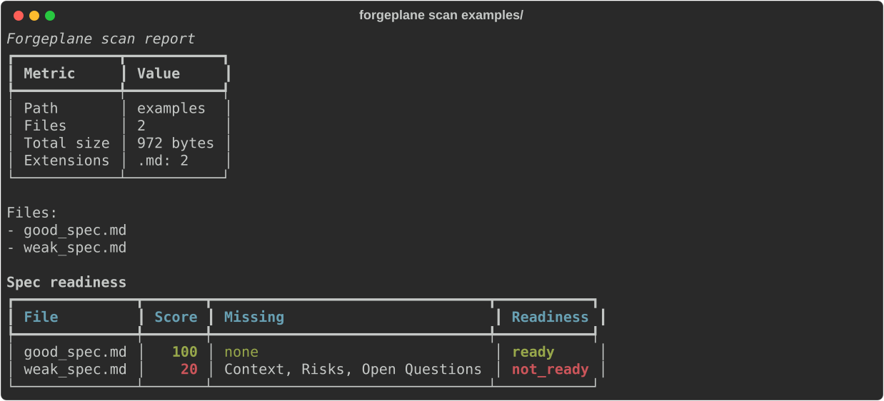

# Forgeplane

[](https://github.com/anton415/forgeplane/actions/workflows/test.yml)
[](https://codecov.io/gh/anton415/forgeplane)
[](LICENSE)
[](https://www.python.org/downloads/)


Forgeplane is an early-stage CLI tool for working with API specifications and documentation.

The project is intended to help developers analyze API documentation, generate or prepare API specifications, and gradually move toward a more structured, specification-driven engineering workflow.

> Status: early development. The public API and CLI commands may change.

## Why Forgeplane?

Modern software development increasingly depends on clear API contracts. Forgeplane is designed as a practical tool for turning API-related materials into more useful engineering artifacts: reports, specifications, checks, and eventually generated API specs.

The long-term goal is to make API specification work faster, more repeatable, and more suitable for AI-assisted development workflows.

## Current capabilities

Forgeplane currently provides a Python CLI with the following early commands:

- `scan` — scans a documentation directory and prints a report.
- `review` — sends a single Markdown spec to an LLM reviewer and validates the
  structured response through Pydantic before rendering it.
- `generate` — placeholder command for future API specification generation.

The `forgeplane.evals.reporter` library module aggregates a batch of
`SpecReview` results into a `pandas` DataFrame, computes a mean readiness
score and a configurable pass rate, persists the batch as a timestamped CSV,
and renders the same data as a `rich` table — useful for tracking prompt
quality across consecutive runs without standing up a database.

The `scan` command reports:

- scanned path;
- number of files;
- total file size;
- file extensions distribution;
- relative file list;
- per-`.md` readiness results (score, missing sections, weak sections, TODO findings, and a readiness label).

Output formats:

- `text` — human-friendly tables rendered through [`rich`](https://rich.readthedocs.io/), including a per-file readiness table with green/yellow/red colour coding and a transient progress bar while specs are scored.
- `json` — machine-readable payload that includes the `results` array with one entry per scanned `.md` file.
- `yaml` — same payload as `json`, formatted for documentation workflows.

The codebase also includes early Pydantic schemas for API readiness checks:

- `SectionCheck` — describes whether an expected documentation section exists, how much content it has, and whether it contains TODO markers.
- `ScanResult` — describes readiness for one file, including a normalized score from `0` to `100`, missing sections, weak sections, TODO findings, and a constrained readiness value: `ready`, `partial`, or `not_ready`.
- `SpecReview` — structured LLM review of one spec file. Carries the
  optional source `file`, a normalized `score` (`0`..`100`), and four lists
  populated by the model: `ambiguities`, `missing_acceptance_criteria`,
  `recommendations`, and `risks`. The schema sets `extra="forbid"`, so any
  unknown keys returned by the model fail validation instead of silently
  reaching the report.

The filesystem scanning logic is split into typed modules:

- `core/files.py` — recursively discovers Markdown spec files and exposes a typed UTF-8 read helper used by the spec scanners.
- `core/config.py` — loads runtime settings (`OPENAI_API_KEY`, `LOG_LEVEL`) from `.env` via `python-dotenv` and configures the Forgeplane logger with a `rich` handler. The `.env` file is *parsed* (not loaded into `os.environ`), so only the supported keys are read and an untrusted project `.env` cannot inject ambient transport variables into the process environment.
- `specs/files.py` — collects file metadata, normalizes extensions, and keeps scan output deterministic.
- `specs/scanner.py` — aggregates file metadata into the public scan report used by the CLI and parses Markdown spec sections.
- `specs/reviewer.py` — assembles the review prompt, dispatches the spec to
  an `LLMClient`, parses the response, and validates it through the
  `SpecReview` schema. Any failure (HTTP, JSON, schema) surfaces as a single
  `LLMError` so callers can catch one stable type. Malformed JSON and Pydantic
  validation failures are redacted through `llm/redaction.py` so the raw
  payload and the failing `input_value` never reach stderr or logs (see
  [Redaction of untrusted responses](#redaction-of-untrusted-responses)).
- `evals/reporter.py` — collects N `SpecReview` results into a typed
  `pandas` DataFrame, exposes `compute_summary` for mean score and pass
  rate, persists the batch as `eval_{timestamp}.csv` for archival, and
  renders the per-file detail plus the aggregate metrics through a `rich`
  table. The same `generate_eval_report` entry point covers both the
  in-memory (notebook, test) and the CSV-archive (CI) workflows.
- `workflow/states.py` — deterministic state model for the upcoming workflow
  engine: the `WorkflowState` and `TaskState` enums, the explicit transition
  tables, transition validation that rejects anything not in the tables, and
  the rules that derive a running workflow's state from its task states. See
  [Workflow state model](#workflow-state-model) below.
- `workflow/model.py` — core workflow domain model built on top of the state
  model: immutable `WorkflowDefinition`/`TaskDefinition` graph types validated
  at construction (duplicate ids, unknown dependencies, and cycles are
  rejected), mutable `WorkflowInstance`/`TaskInstance` runtime records, and
  the `TaskInput`/`TaskResult`/`TaskError` data contracts. See
  [Workflow domain model](#workflow-domain-model) below.
- `llm/client.py` — defines the `LLMClient` Protocol used by the reviewer
  and ships an `OpenAIChatClient` HTTP implementation that calls
  OpenAI-compatible Chat Completions endpoints with `response_format=json_object`
  via `httpx`. The request is wrapped in a `tenacity` retry policy
  (`stop_after_attempt(3)`, `wait_exponential(min=1, max=10)`) that retries
  rate limits (HTTP 429), server errors (HTTP 5xx), and network transport
  failures, while terminal errors (4xx other than 429, malformed JSON,
  missing fields) raise the single `LLMError` exception immediately. A
  retryable subclass `LLMRetryableError` keeps the failure type stable for
  callers that catch the base class. Every attempt and backoff sleep is
  logged through the rich-handled Forgeplane logger so `--verbose`
  invocations show the retry timeline. Tests substitute the client through
  a `Protocol`-conformant fake without hitting the network. Unexpected
  response shapes and malformed JSON bodies are summarised through
  `llm/redaction.py` before they reach the `LLMError` message, so a
  provider-controlled payload is never reflected verbatim into CLI output.
- `llm/redaction.py` — security helpers that turn untrusted LLM/provider
  response data into concise, content-free summaries for error messages. They
  describe a payload by shape and bounded size, reduce a `json.JSONDecodeError`
  to its reason and position (never the document), and rebuild a Pydantic
  `ValidationError` from the field path and error category alone — dropping the
  `input_value` that would otherwise leak reviewed-spec or prompt-derived text
  into stderr and CI logs.

The Markdown section parser extracts the body of each expected `##` heading from a spec file and returns a `dict[str, str | None]` keyed by the expected section names: `Goal`, `Context`, `Acceptance Criteria`, `Risks`, `Open Questions`. Missing or empty sections collapse to `None`. Headings follow CommonMark ATX rules (up to three spaces of indent, an optional closing run of `#`s), and `##` lines that appear inside fenced code blocks are ignored. Sample inputs live in `examples/good_spec.md` and `examples/weak_spec.md`.

The source tree is checked with `mypy` in strict mode.

## Workflow state model

Forgeplane is growing a small deterministic workflow engine. Its foundation —
implemented in `forgeplane/workflow/states.py` — is a fixed state model with
explicit transition tables. The model deliberately avoids BPMN/Camunda
vocabulary: every state and every legal transition is enumerable, so the
whole model is covered by exhaustive tests before DSL, persistence, API, or
visual features are added on top.

Workflow states and their valid transitions:

| From | To |
| --- | --- |
| `draft` | `ready`, `cancelled` |
| `ready` | `running`, `cancelled` |
| `running` | `paused`, `completed`, `failed`, `cancelled` |
| `paused` | `running`, `cancelled` |
| `completed` | — (terminal) |
| `failed` | — (terminal) |
| `cancelled` | — (terminal) |

Task states and their valid transitions:

| From | To |
| --- | --- |
| `pending` | `ready`, `skipped` |
| `ready` | `running`, `blocked`, `skipped` |
| `running` | `completed`, `failed`, `blocked` |
| `blocked` | `ready`, `failed`, `skipped` |
| `completed` | — (terminal) |
| `failed` | — (terminal) |
| `skipped` | — (terminal) |

Both enums are `StrEnum`s, so the serialized form equals the documented value
(`WorkflowState.RUNNING == "running"`). `transition_workflow` and
`transition_task` validate a move against the tables and raise
`InvalidTransitionError` (a `ValueError` subclass carrying the offending
`kind`, `current`, and `target`) for anything not listed — including
self-transitions and any move out of a terminal state.

Task state changes affect workflow state through `derive_workflow_state`,
which encodes the completion and failure rules for a *running* workflow:

1. **Failure (fail-fast):** any `failed` task fails the whole workflow
   immediately, even if other tasks are still in flight.
2. **Completion:** when every task is terminal (`completed` or `skipped`) and
   none failed, the workflow is `completed`. A workflow with no tasks
   completes vacuously.
3. Otherwise the workflow keeps `running`.

`paused` and `cancelled` are operator decisions and are never derived from
task states.

Both `derive_workflow_state` and the `tasks_may_progress` gate also accept
the serialized string form of a state and coerce it through the enum, so
values loaded from JSON/YAML behave identically to enum members; unknown
values raise `ValueError` instead of being miscounted as in-flight work.

Invariants that must never be violated (each is verified by
`tests/test_workflow_states.py`):

1. Terminal states have no outgoing transitions.
2. Self-transitions are never valid; a transition always changes the state.
3. Task states may only change while the owning workflow is `running`
   (the `tasks_may_progress` gate).
4. A workflow completes only when every task is terminal and none failed.
5. A workflow derived from its tasks fails as soon as any task fails.

## Workflow domain model

The core domain objects of the workflow engine live in
`forgeplane/workflow/model.py`, layered directly on the state model. The
module depends only on the standard library and `workflow/states.py` — no
HTTP, API, or persistence framework — so the domain types can be embedded
anywhere and tested in isolation.

Immutable definitions (frozen dataclasses, validated at construction):

- `TaskDefinition` — one unit of work: a unique `task_id`, a non-empty
  `task_type` the engine will dispatch on (for example `"shell"` or
  `"llm_review"`), the `depends_on` set of upstream task ids, and the
  authored `parameters` that seed the runtime input. Blank ids/types and
  self-dependencies are rejected.
- `WorkflowDefinition` — a validated workflow graph: a `workflow_id` plus a
  tuple of task definitions whose `depends_on` edges must form a DAG.
  Construction raises `InvalidDefinitionError` (a `ValueError` subclass) for
  duplicate task ids, dependencies on unknown tasks, and dependency cycles,
  so an invalid graph can never exist as a `WorkflowDefinition` value.
  `execution_order()` returns a deterministic dependency-respecting order,
  and `task()`/`task_ids` expose the graph for the future engine.

Mutable runtime records (one per execution, state separate from definition):

- `WorkflowInstance` — created from a definition via
  `WorkflowInstance.from_definition(definition, instance_id=...)`; it starts
  in the `ready` workflow state (the definition already proved itself valid)
  with every task `pending`. All state changes go through its methods, so
  the transition tables and the cross-object invariants of the state model
  hold by construction: `transition_to` validates workflow moves and accepts
  the outcome states `completed`/`failed` only when the task states actually
  derive them (invariants 4 and 5), while `transition_task`, `start_task`,
  and `record_result` enforce the `tasks_may_progress` gate (invariant 3) by
  raising `TasksFrozenError` whenever the workflow is not `running`.
- `TaskInstance` — the per-execution record of one task: its shared
  immutable definition plus the runtime `state`, `input`, and `result`.

Data contracts that cross a task boundary (immutable snapshots; payloads are
copied on construction and exposed read-only):

- `TaskInput` — the parameter payload a task receives when it starts,
  attached by `start_task`.
- `TaskResult` — the outcome of a finished task: a success `output` payload
  or a structured `error`, never both. `record_result` derives the terminal
  task state from the result (`completed` on success, `failed` on error), so
  state and result cannot contradict each other, and terminal states make a
  recorded result effectively write-once.
- `TaskError` — the structured failure shape: a machine-readable `code`, a
  human-readable `message`, free-form `details`, and a `retryable` hint for
  the future engine.

A minimal end-to-end construction looks like this:

```python
from forgeplane.workflow import (
    TaskDefinition,
    TaskInput,
    TaskResult,
    TaskState,
    WorkflowDefinition,
    WorkflowInstance,
    WorkflowState,
)

definition = WorkflowDefinition(
    workflow_id="docs-pipeline",
    tasks=(
        TaskDefinition(task_id="fetch", task_type="http"),
        TaskDefinition(
            task_id="publish", task_type="shell", depends_on=frozenset({"fetch"})
        ),
    ),
)

instance = WorkflowInstance.from_definition(definition, instance_id="run-1")
instance.transition_to(WorkflowState.RUNNING)
for task_id in definition.execution_order():
    instance.transition_task(task_id, TaskState.READY)
    instance.start_task(task_id, TaskInput(parameters={"task": task_id}))
    instance.record_result(task_id, TaskResult.success({"done": True}))
instance.transition_to(WorkflowState.COMPLETED)
```

Scheduling, dispatching by task type, persistence, and an API remain engine
concerns and are intentionally out of scope for the domain model.

## Installation

Forgeplane uses Python `>=3.13`.

Clone the repository:

```bash
git clone https://github.com/anton415/forgeplane.git
cd forgeplane
```

Install dependencies with `uv`:

```bash
uv sync
```

Run the CLI:

```bash
uv run forgeplane --help
```

If you prefer editable installation with `pip`:

```bash
pip install -e .
forgeplane --help
```

## Configuration

Forgeplane reads runtime settings from a `.env` file in the current working
directory via `python-dotenv`. Variables already set in the process
environment take precedence over the file, which keeps CI configuration
stable when a `.env` file is missing.

Copy the bundled example to get started:

```bash
cp .env.example .env
```

Supported variables:

- `OPENAI_API_KEY` — reserved for future LLM-backed commands (review, eval).
  Leave empty until the LLM integration lands; Forgeplane never logs its
  value.
- `LOG_LEVEL` — threshold for the Forgeplane logger. One of `DEBUG`, `INFO`,
  `WARNING`, `ERROR`, `CRITICAL`. Defaults to `INFO` when unset or
  unrecognised. Pass `--verbose` on the CLI to force `DEBUG` for a single
  command invocation.

Logging is wired to `rich.logging.RichHandler`, so log records render with
the same styling as the rest of the CLI output.

### `.env` isolation

`.env` is **parsed**, not loaded into `os.environ`: Forgeplane reads only the
two supported keys above and ignores everything else in the file. This means a
`.env` placed in an untrusted or third-party documentation repository cannot
inject ambient transport variables — proxy settings such as `HTTP_PROXY` /
`HTTPS_PROXY` / `ALL_PROXY`, or certificate settings such as `SSL_CERT_FILE` /
`REQUESTS_CA_BUNDLE` — into the process environment.

As a second layer of defence, the OpenAI HTTP client runs with
`trust_env=False` by default, so it does not implicitly honour proxy or
certificate variables from the surrounding environment for outbound LLM
requests. Operators who genuinely run behind a corporate proxy can opt back in
by constructing `OpenAIChatClient(..., trust_env=True)`. Together these protect
the API key and the reviewed spec contents from being redirected or intercepted
when Forgeplane is run inside an untrusted repository.

To skip the project `.env` entirely — for example in CI or a production
wrapper — set `PYTHON_DOTENV_DISABLED` to a truthy value (`1`, `true`, `t`,
`yes`, `y`). Forgeplane then reads settings only from the real process
environment.

## Usage

### Scan documentation

```bash
forgeplane scan path/to/docs
```

Text output is used by default. While the command processes Markdown specs,
`rich.progress` shows a spinner with the current file count and elapsed time.
Once scoring is finished, two tables are printed: a directory summary and a
readiness table with the columns **File**, **Score**, **Missing**, and
**Readiness**.

Colour coding follows the readiness thresholds:

- **green** — score ≥ 80, readiness `ready`;
- **yellow** — score ≥ 60, readiness `partial`;
- **red** — score < 60, readiness `not_ready`.

A reproducible SVG snapshot of the report against the bundled examples lives
at [`docs/reports/scan_report.svg`](docs/reports/scan_report.svg) and can be
regenerated with:

```bash
uv run python scripts/generate_report_artifact.py
```



### Verbose logging

Add `--verbose` (or `-v`) to log each scan step at `DEBUG` through a `rich`
handler. The flag overrides `LOG_LEVEL` for the current invocation:

```bash
forgeplane scan path/to/docs --verbose
```

### JSON output

```bash
forgeplane scan path/to/docs --format json
```

### YAML output

```bash
forgeplane scan path/to/docs --format yaml
```

### Saving the report for CI

Pass `--output-dir` (alias `-o`) together with `--format json` or
`--format yaml` to also write the payload to disk. The file is named
`scan_{timestamp}.{ext}`, where the timestamp is UTC in
`YYYYMMDDTHHMMSSZ` form, so the path is deterministic for any given moment
and trivial to archive as a build artifact:

```bash
forgeplane scan path/to/docs --format json --output-dir reports/
# writes reports/scan_20260608T123456Z.json
```

The directory is created if it does not exist. The same payload is still
printed to stdout, so a CI step can both archive the file and pipe the
report through `jq` or `yq` in the same job. The default `reports/` path
is ignored by Git via the bundled `.gitignore`.

### Review a Markdown spec with an LLM

```bash
forgeplane review docs/specs/todo-module.md
```

The command sends the spec to an OpenAI-compatible Chat Completions endpoint
in JSON mode, validates the response against the `SpecReview` Pydantic
schema, and renders the result as a rich Table by default. Findings collapse
to an explicit `none` placeholder when the model has nothing to flag for a
category, so an empty list never looks like a missing key.

`OPENAI_API_KEY` is required for this command. Add it to your `.env` (see
[Configuration](#configuration)) or set it in the process environment. The
CLI fails fast with a single non-zero exit and a clear error message when
the key is missing.

Choose a different model with `--model` / `-m`:

```bash
forgeplane review docs/specs/todo-module.md --model gpt-4o
```

Switch to a machine-readable format for CI integrations:

```bash
forgeplane review docs/specs/todo-module.md --format json
forgeplane review docs/specs/todo-module.md --format yaml
```

Example JSON payload (the source file name is attached after validation, so
it never relies on the model to populate it):

```json
{
  "file": "todo-module.md",
  "score": 72,
  "ambiguities": ["the term 'fast' is undefined"],
  "missing_acceptance_criteria": ["pagination semantics"],
  "recommendations": ["specify pagination limits"],
  "risks": ["timezone handling"]
}
```

Transient upstream failures (HTTP 429, HTTP 5xx, network transport errors)
are retried up to three times with exponential backoff between 1 s and
10 s, courtesy of [`tenacity`](https://tenacity.readthedocs.io/). Terminal
errors (HTTP 4xx other than 429, malformed JSON, missing fields) surface
immediately as a single `LLMError`. The CLI converts that into a
non-zero exit code, so a missing API key or a permanent 4xx fails fast
without a retry storm.

Add `--verbose` (or `-v`) to log review steps at `DEBUG` through the same
rich handler as the rest of the CLI. With `--verbose` you also see each
attempt counter (`LLM request attempt 1/3`, …) and the backoff sleep
between attempts.

#### Redaction of untrusted responses

A misbehaving provider — or a prompt-injection attempt inside the reviewed
spec — can produce a malformed or off-schema response. Forgeplane treats every
LLM/provider response as untrusted and never reflects its raw bytes into the
`LLMError` it surfaces. Instead the error carries a concise, content-free
summary that keeps the diagnostic signal without leaking content into your
terminal or CI logs:

- **Malformed JSON** is reported by reason and position only (for example
  `Expecting value (line 1 column 1)`), never the offending document.
- **Schema validation failures** are reported by the failing field path and a
  stable error category (for example `score: less_than_equal`). Pydantic's
  default `input_value` — which would echo the model's actual value — is
  dropped.
- **Unexpected response shapes** are reported by container type and bounded
  size (for example `JSON object with 2 field(s)`), never the decoded keys or
  values.

The full low-level exception is still chained on `__cause__` for interactive
debugging, but it is not rendered by default, so reviewed-spec content and
provider-controlled text stay out of stderr and archived CI logs.

### Track review quality across runs

The `forgeplane.evals.reporter` module turns a batch of
`SpecReview` objects into a pandas DataFrame and computes the headline
metrics — mean score and pass rate — that are most useful for tracking how
prompt changes affect review quality over time:

```python
from pathlib import Path

from forgeplane.evals.reporter import generate_eval_report
from forgeplane.specs.schemas import SpecReview

reviews = [
    SpecReview(file="todo-module.md", score=85, recommendations=["add examples"]),
    SpecReview(file="auth-module.md", score=55, risks=["session storage"]),
]

report = generate_eval_report(reviews, output_dir=Path("reports/"))
print(report.summary.mean_score, report.summary.pass_rate)
# Persists reports/eval_{timestamp}.csv with per-file scores and finding counts.
```

The default pass threshold (`80`) matches the scanner's `READY_THRESHOLD`
so the same 0..100 cut-off applies across both the static scan and the LLM
review signals; override it with the `pass_threshold` argument when a
different quality bar is in play. The returned `EvalReport` carries the
DataFrame, the `EvalSummary`, and the on-disk CSV path (or `None` when no
`output_dir` was supplied). Call `print_eval_table` to render the same
data as a rich table in the terminal.

### Generate API specification

```bash
forgeplane generate https://example.com/api --output spec.yaml
```

This command is currently a placeholder and will be implemented in future versions.

## Example

```bash
forgeplane scan path/to/docs --format json
```

Example output:

```json
{
  "path": "/path/to/docs",
  "files_count": 2,
  "total_size_bytes": 128,
  "extensions": {
    ".md": 1,
    ".yaml": 1
  },
  "files": [
    "api.md",
    "openapi.yaml"
  ],
  "results": [
    {
      "file": "api.md",
      "score": 80,
      "missing": [],
      "weak": ["Open Questions"],
      "todos_found": [],
      "readiness": "ready"
    }
  ]
}
```

The `results` array contains one entry per discovered `.md` file. Each entry
is the JSON form of the `ScanResult` Pydantic model defined in
`forgeplane/specs/schemas.py`.

## Project structure

```text
forgeplane/
├── src/
│   └── forgeplane/
│       ├── __init__.py
│       ├── cli.py
│       ├── main.py
│       ├── core/
│       │   ├── __init__.py
│       │   ├── config.py
│       │   └── files.py
│       ├── evals/
│       │   ├── __init__.py
│       │   └── reporter.py
│       ├── llm/
│       │   ├── __init__.py
│       │   ├── client.py
│       │   └── redaction.py
│       ├── specs/
│       │   ├── __init__.py
│       │   ├── files.py
│       │   ├── reviewer.py
│       │   ├── scanner.py
│       │   └── schemas.py
│       └── workflow/
│           ├── __init__.py
│           ├── model.py
│           └── states.py
├── tests/
│   ├── conftest.py
│   ├── test_cli_rich.py
│   ├── test_config.py
│   ├── test_evals_reporter.py
│   ├── test_files.py
│   ├── test_redaction.py
│   ├── test_reviewer.py
│   ├── test_scanner.py
│   ├── test_scoring.py
│   ├── test_workflow_model.py
│   └── test_workflow_states.py
├── examples/
│   ├── good_spec.md
│   └── weak_spec.md
├── scripts/
│   ├── check_sdist.sh
│   └── generate_report_artifact.py
├── docs/
│   ├── reports/
│   │   └── scan_report.svg
│   └── specs/
│       └── todo-module.md
├── .env.example
├── Makefile
├── main.py
├── CODE_OF_CONDUCT.md
├── CONTRIBUTING.md
├── LICENSE
├── NOTICE
├── SECURITY.md
├── pyproject.toml
├── uv.lock
└── README.md
```

## Development

Install dependencies:

```bash
uv sync
```

Run the CLI locally:

```bash
uv run forgeplane --help
```

Run a scan against a documentation directory:

```bash
uv run forgeplane scan path/to/docs
```

Run the full local lint gate:

```bash
make lint
```

`make lint` checks Ruff formatting, runs Ruff lint rules, and then runs strict
`mypy` against `src/`. Ruff is configured in `pyproject.toml` for Python 3.13,
import sorting, pyupgrade rules, bugbear checks, and safe simplifications.

Run Ruff directly:

```bash
uv run ruff check .
uv run ruff format .
```

Run strict type checking:

```bash
uv run mypy src/
```

Run the test suite:

```bash
uv run pytest -v
```

Verify release packaging before publishing:

```bash
make check-sdist
```

`make check-sdist` rebuilds `dist/` with `uv build` and then runs
`scripts/check_sdist.sh`, which lists every entry in the source distribution
(`tar -tzf dist/*.tar.gz`) and fails if any local-only path leaked into the
archive: `.claude/` tool worktrees, `.env` files, virtualenvs, caches,
coverage data, scan reports, or build leftovers. The deny list mirrors the
explicit sdist exclusions under `[tool.hatch.build.targets.sdist]` in
`pyproject.toml`, which guarantee those paths are dropped even when the build
runs outside a git checkout where `.gitignore` rules would not apply. Wheels
are unaffected: they only ever package `src/forgeplane` plus the Apache-2.0
`LICENSE` and `NOTICE` files declared in the project metadata.

Tests live under `tests/` and share fixtures defined in `tests/conftest.py`, which load the bundled `examples/good_spec.md` and `examples/weak_spec.md` through the section parser. `test_files.py` covers Markdown discovery against empty and nested directories, `test_scanner.py` covers the Markdown section parser, `test_config.py` covers environment loading, log-level normalization, and the `--verbose` CLI flag, `test_scoring.py` covers readiness scoring and the threshold-to-enum mapping, `test_cli_rich.py` covers the rich rendering helpers (colour mapping, readiness table, the JSON `results` field, and the `--output-dir` report-saving path used by CI integrations), `test_reviewer.py` covers the `SpecReview` schema, the prompt assembly, the `parse_review_response` validation, the `OpenAIChatClient` HTTP path (driven by `httpx.MockTransport`), and the `forgeplane review` CLI command using a `Protocol`-conformant fake LLM client (including the redaction guards that assert malformed JSON, off-schema responses, and unexpected provider shapes never print or log their raw content), `test_redaction.py` covers the `llm/redaction.py` helpers directly — the payload-shape summary, the JSON-decode-error redaction, and the Pydantic `ValidationError` summary that drops `input_value` while keeping the field path and error category, and replaces a rejected provider-supplied extra key with a placeholder rather than echoing it, `test_evals_reporter.py` covers the pandas DataFrame builder, the mean-score and pass-rate aggregates (default and custom thresholds), the timestamped CSV persistence, and the rich eval table rendering, `test_workflow_states.py` covers the workflow/task state model: the enum values, the transition tables, every valid transition, every invalid transition (asserted exhaustively as the complement over the full state-pair product), the terminal-state and no-self-transition invariants, the `tasks_may_progress` gate, and the completion/failure derivation rules, and `test_workflow_model.py` covers the workflow domain model: construction and validation of the definitions (blank ids, self-dependencies, duplicate task ids, unknown dependencies, direct and indirect cycles), the deterministic `execution_order`, the immutability of the `TaskInput`/`TaskResult`/`TaskError` payload snapshots, instance creation from a definition, the running-workflow gate on task mutations, the contract-carrying transitions (`start_task`, `record_result`), and the derivation guards on `completed`/`failed` workflow moves.

## Roadmap

Planned directions:

- Build the MVP workflow engine on top of the state and domain model (DSL, persistence, API).
- Improve documentation scanning and validation.
- Add checks for OpenAPI files.
- Implement real API specification generation.
- Support richer reports for API readiness.
- Add examples for real-world API documentation.
- Expand contribution guidelines as the project matures.
- Publish package metadata and release process.

## Design principles

Forgeplane should be:

- CLI-first — easy to run locally, in CI, and from scripts.
- Spec-oriented — focused on API contracts and structured engineering artifacts.
- AI-friendly — useful as part of AI-assisted development pipelines.
- Incremental — helpful even before full automatic generation exists.
- Transparent — reports should be readable by both humans and tools.

## Contributing

The project is at an early stage, so contributions should start with small, focused changes.

Good first contribution areas:

- improve CLI help text;
- add tests for `scan`;
- improve output formatting;
- add OpenAPI validation;
- improve example documentation;
- add GitHub Actions CI.

Before submitting larger changes, open an issue describing the proposed direction.

See [CONTRIBUTING.md](CONTRIBUTING.md) for local setup and contribution licensing, and [CODE_OF_CONDUCT.md](CODE_OF_CONDUCT.md) for community guidelines.

## Security

To report a security vulnerability privately, please follow the process in [SECURITY.md](SECURITY.md).

## License

Forgeplane is licensed under the [Apache License 2.0](LICENSE). See the [NOTICE](NOTICE) file for attribution requirements.

Copyright 2026 Anton Serdyuchenko.
